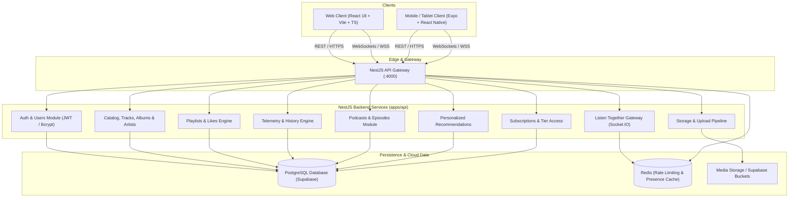

# Sonique — System Architecture

**Sonique** is a modern, distributed full-stack music and podcast streaming platform engineered for high performance, responsive playback across Web, Mobile, and Tablet form factors, and real-time synchronized group listening.

---

## 1. High-Level Architecture



---

## 2. Monorepo Structure

```
sonique/
├── apps/
│   ├── api/             # NestJS REST & WebSocket Backend
│   ├── web/             # React 18 + Vite + TypeScript Web Client
│   └── mobile/          # Expo + React Native Mobile & Tablet Client
├── packages/
│   └── shared/          # Central TypeScript data models & contracts
├── prisma/              # Prisma schema, migrations, and canonical seed data
├── docs/                # Technical documentation (API, Architecture, Deployment, Development)
├── docker-compose.yml   # Multi-container orchestration (PostgreSQL & Redis)
└── package.json         # Workspace root scripts & tooling
```

---

## 3. Web Architecture (`apps/web`)

- **Framework**: React 18, TypeScript, Vite.
- **State Management**: Lightweight modular Zustand stores (`playerStore`, `authStore`, `playlistStore`).
- **Audio Engine**: Dual-stream hybrid playback engine:
  - HTML5 Audio for direct lossless/compressed streams (MP3/WAV/AAC).
  - Headless YouTube IFrame API integration for embedded audio sources.
  - Turntable deck with vinyl RPM, pitch bend, tonearm tracking, and soundwave visualization.
- **Styling**: Vanilla CSS design system with glassmorphism, responsive grid scaling, and modern dark aesthetics.

---

## 4. Mobile & Tablet Architecture (`apps/mobile`)

- **Framework**: React Native 0.74, Expo 51, TypeScript.
- **Responsive Layout System**:
  - **Phone**: Bottom navigation bar, compact transport bar, and single-column media views.
  - **Tablet**: Adaptive side navigation rail, side-by-side vinyl deck & queue inspector, and responsive multi-column card grids.
- **Audio Engine**: `expo-av` audio player supporting background audio playback, seek scrubbing, queue reordering, and playback position persistence.
- **Real-Time Client**: Socket.IO client connecting directly to the `/rooms` gateway for synchronized group listening.

---

## 5. Backend Architecture (`apps/api`)

- **Framework**: NestJS 10+ (Node.js runtime).
- **Database Access**: Prisma ORM with `@prisma/adapter-pg` connecting to PostgreSQL (Supabase compatible).
- **Authentication**: JWT access token (15m expiry) with transparent refresh token rotation (30d expiry) stored in HTTP-only cookies and persistent mobile secure storage.
- **Caching & Rate Limiting**: Redis-backed distributed rate limiter ([rate-limit.guard.ts](file:///c:/SQL/SONIQUE/apps/api/src/common/rate-limit.guard.ts)) with in-memory fallback.
- **Real-Time Gateway**: Socket.IO gateway (`RoomsGateway`) managing active room state, listener synchronization, live chat broadcasts, and emoji reactions.

---

## 6. Persistence & Data Layer

- **Database**: PostgreSQL with rich relational models defined in [prisma/schema.prisma](file:///c:/SQL/SONIQUE/prisma/schema.prisma):
  - `User`, `Artist`, `Album`, `Track`, `Playlist`, `PlaylistTrack`, `Like`, `PlaybackEvent`, `PodcastShow`, `PodcastEpisode`, `Subscription`.
- **Supabase Integration**: Native compatibility with Supabase PostgreSQL connection poolers (`aws-0-*.pooler.supabase.com`) with SSL verification and Supabase Storage buckets.
