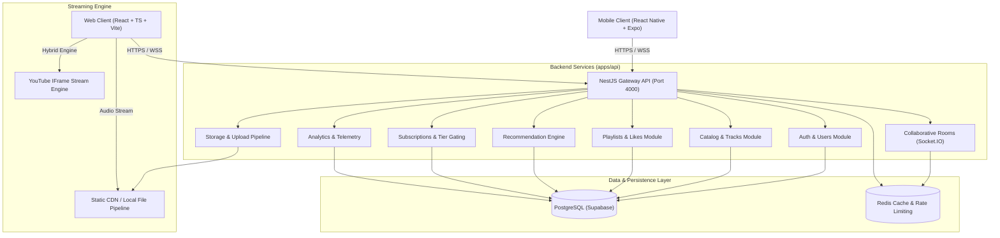

# Sonique - Architecture System Overview

Sonique is a modern, high-performance distributed audio streaming platform offering real-time music and podcast streaming, collaborative listening rooms, personalized recommendations, lossless audio quality tiers, and artist analytics.

## System Architecture

## Core Modules & Design Decisions

1. **Hybrid Playback Engine**:
   - Standard direct MP3/WAV/AAC streams played via HTML5 `<audio>`.
   - Dynamic YouTube audio streams embedded via headless YouTube IFrame API.
   - 5-second periodic playback telemetry emitted to `/api/playback/event` to track user stream records and listening history without degrading client performance.

2. **Real-time Synchronization (Listen Together)**:
   - WebSocket rooms running over Socket.IO (`/rooms` namespace).
   - Dynamic host-to-listener synchronization (<250ms drift compensation).
   - In-memory room manager with fallback caching.

3. **Tiered Access & Monetization**:
   - `FREE`: 128kbps AAC playback, standard catalog browsing.
   - `PREMIUM`: 320kbps High-Fidelity Lossless audio, collaborative room hosting, ad-free listening, and offline caching.

4. **Recommendation Engine**:
   - Genre affinity scoring computed against user's recent listening history.
   - Dynamic "Discover Weekly" generation algorithm.
